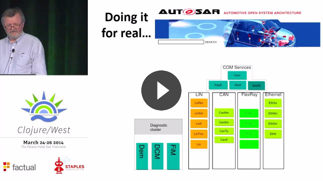

# [ElmPrague](https://www.meetup.com/ElmPrague/): [Game of Life](https://en.wikipedia.org/wiki/Conway%27s_Game_of_Life) Coding Dojo

## Requirements

- [elm](http://elm-lang.org/)
- [nvm](https://github.com/creationix/nvm)

Then run:

```sh
nvm install `cat .nvmrc`
nvm use
npm install --global yarn
```

## Install

```sh
nvm use
yarn install
elm package install -y
```

## Run Tests

- once: `yarn test`
- in watch mode: `yarn test:watch`

## Run Web App

```sh
elm reactor
```

And open [localhost:8000](http://localhost:8000)

## More Info

Property base testing talk by John Hughes:

<a href="https://youtu.be/zi0rHwfiX1Q"></a>

- [Game of Life](https://en.wikipedia.org/wiki/Conway%27s_Game_of_Life)
- [Elm Syntax vs JS](http://elm-lang.org/docs/from-javascript) and [Syntax](http://elm-lang.org/docs/syntax)
- [`elm-test` v3.1.0](https://github.com/elm-community/elm-test/tree/3.1.0)
  - we are using also [`node-test-runner` to run tests in Node.js](https://github.com/rtfeldman/node-test-runner)
- [`elm-format`](https://github.com/avh4/elm-format)
- [Elm signals visualization](https://yang-wei.github.io/elmflux/)
- [ElmLive - Random Maps by `elm-format` author](https://youtu.be/rgdZZuM513w)
- Check [`dojo-start`](https://github.com/elm-prague/2017-04-29-elm-test-dojo/tree/dojo-start) and [`dojo-end`](https://github.com/elm-prague/2017-04-29-elm-test-dojo/tree/dojo-end) tags to see code at the beggining and at the end of Coding Dojo ([diff is here](https://github.com/elm-prague/2017-04-29-elm-test-dojo/compare/dojo-start...dojo-end))
